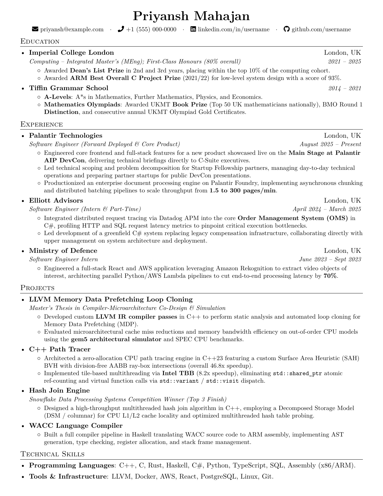

# Priyansh Mahajan — Curriculum Vitae

Personal LaTeX source code and build setup for my single-page software engineering Curriculum Vitae (CV), adapted from [Sourabh Bajaj's resume template](https://github.com/sbajaj92/resume).

## Quick Start & Setup

1. **Create your secrets file**:
   ```bash
   cp secrets.example.tex secrets.tex
   ```
2. **Update contact details** in `secrets.tex` (phone, email, address, etc.).

### Building the CV

- **Build Real PDF for Job Applications (`build.py`)**:
  Compiles `priyansh_mahajan_cv.pdf` using your real contact details from `secrets.tex`:

  ```bash
  python build.py
  ```

- **Build Public Preview for GitHub (`build_preview.py`)**:
  Compiles `priyansh_mahajan_cv.pdf` and `cv_preview.png` using `secrets.example.tex` so no private contact info is exposed:

  ```bash
  python build_preview.py
  ```

- **Option 2 — Custom Local LaTeX Compiler**:
  You can compile `priyansh_mahajan_cv.tex` using any modern LaTeX compiler of your choice (such as [Tectonic](https://tectonic-typesetting.github.io/), XeLaTeX, or LuaLaTeX). Note: `pdflatex` does not work with this.



## License & Copyright

* **Code**: [MIT License](LICENSE) (Adapted from [Sourabh Bajaj](https://github.com/sbajaj92/resume)).
* **Content**: All personal details copyright © Priyansh Mahajan.
